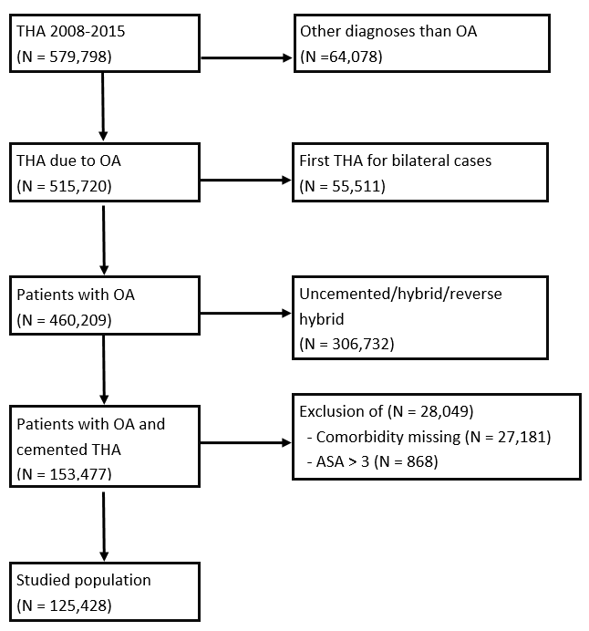
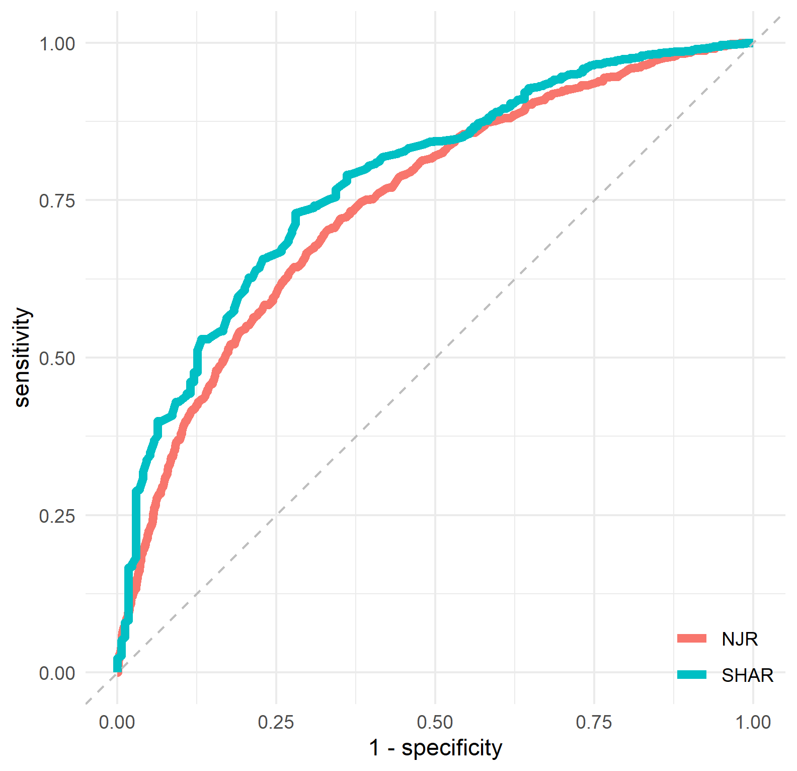
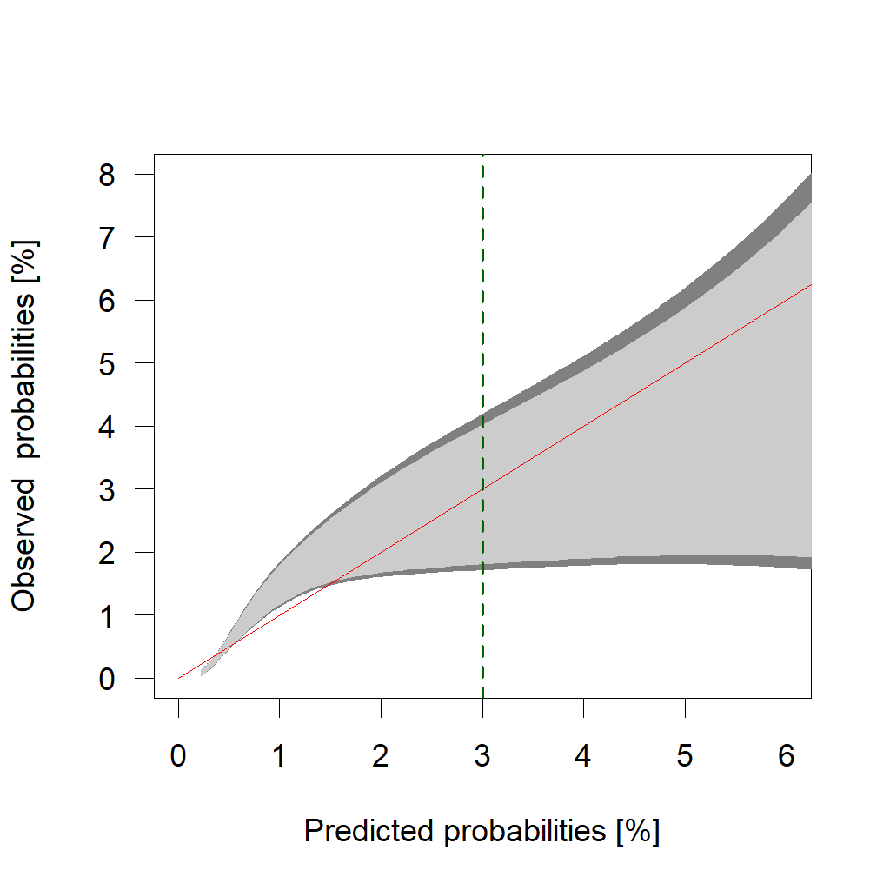

```{r setup, include=FALSE}
knitr::opts_chunk$set(echo = FALSE, message = FALSE)
library(tidyverse)
```


# Flowchart

Patients included from NJR. (Many excluded due to fixation.)

```{r}

```

# Summary table

## NJR
```{r}
njr_demography_table <- 
  read_delim(
    "../data/njr_demography_table.csv", ";", 
    escape_double = FALSE, comment = "#", trim_ws = TRUE
  ) %>% 
  mutate_all(~gsub("([^[:space:]])(\\()", "\\1 \\2", ., perl = TRUE)) %>% 
  mutate(
    level = gsub("(ASA )([1-3])(.*)", "\\2", What, perl = TRUE),
    What  = gsub("(ASA)( [1-3])(.*)", "\\1", What, perl = TRUE),
    level = if_else(What == "ASA", level, ""),
    What = if_else(duplicated(What), "", What)
  ) %>% 
  select(What, level, everything())

njr_demography_table
```

## To be compared with SHAR:

```{r}
load("../cache/table1.RData")
table1 %>% 
  mutate(
    what = na_if(what, ""),
    what = zoo::na.locf(what)
    ) %>% 
  filter(
    grepl("^n$|Age|Sex|ASA|Cancer|CNS|Kidney", what)
  )
```

# ROC curve

```{r}

```

# AUC

```{r}
knitr::include_graphics("../graphs/brlasso_auc_ci.png")
```

# Calibration

Model as-is overestimates probabilityies (as expected) but a re-calibrated version looks like this:

```{r}

```

To compare with SHAR:

```{r}
knitr::include_graphics("../graphs/calibration_belt.png")
```

