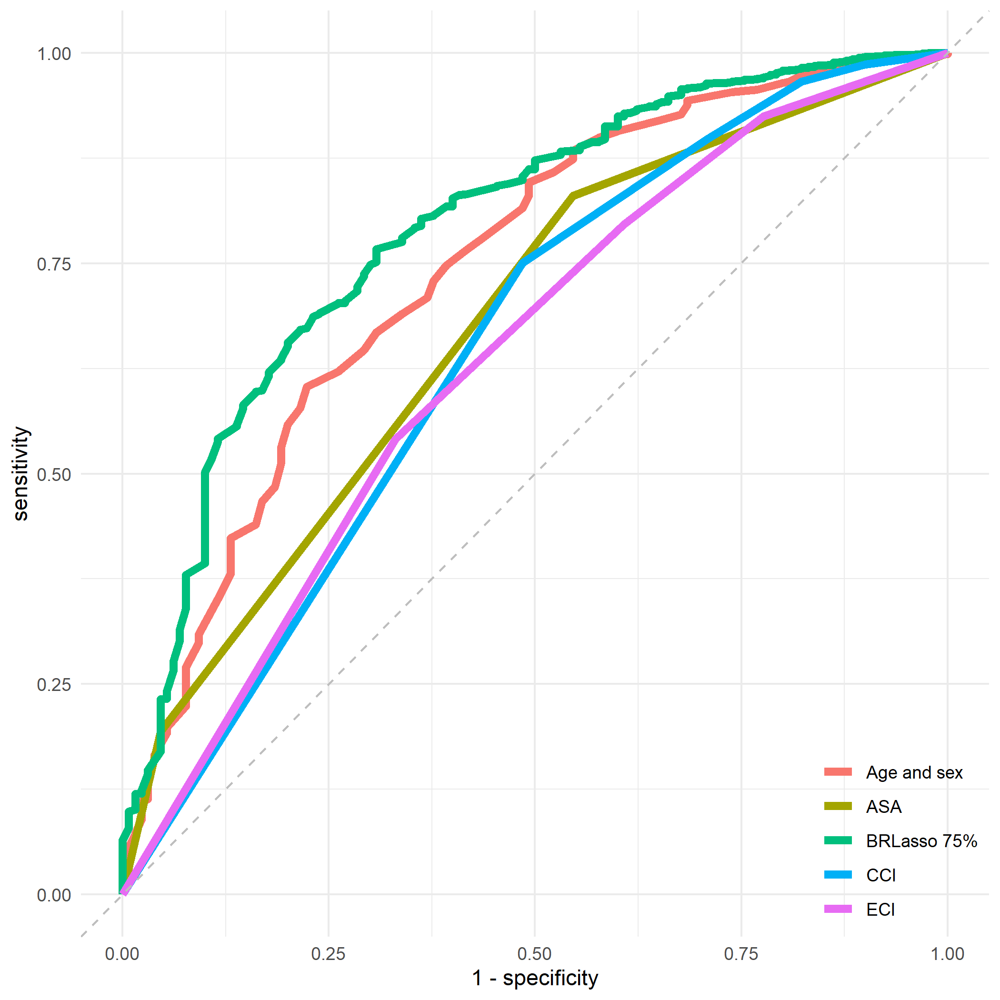
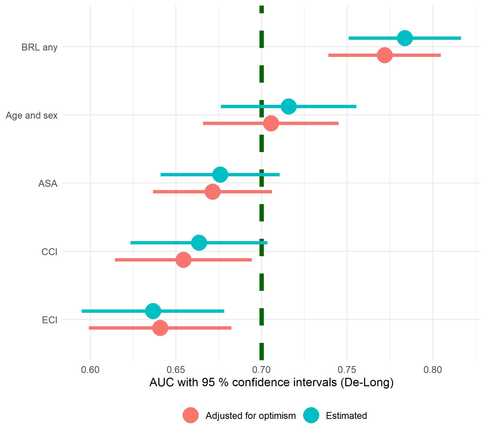
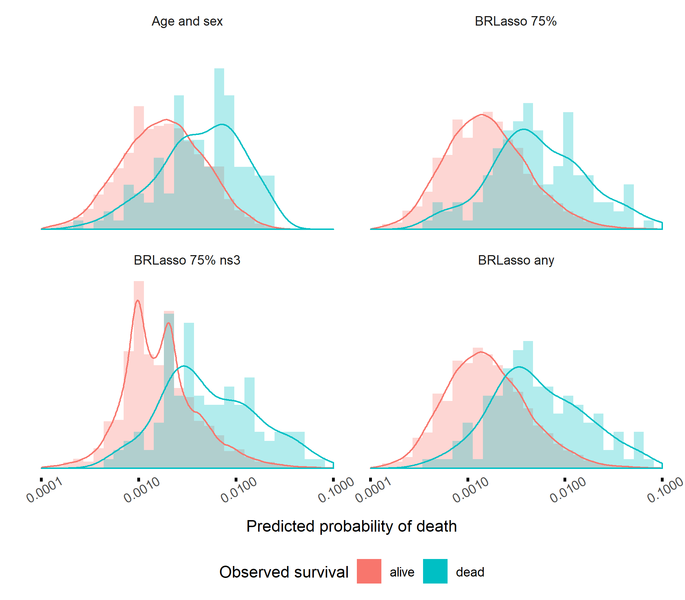

```{r setup, include=FALSE}
knitr::opts_chunk$set(echo = FALSE)
```


```{r}
load("../cache/table1.RData")
table1
```


```{r}

```


```{r}

```


```{r}

```

```{r}
load("../cache/brlasso_tbl_auc.RData")
brlasso_tbl_auc
```


```{r}
load("../cache/brlasso_tbl_coefs.RData")
brlasso_tbl_coefs
```
