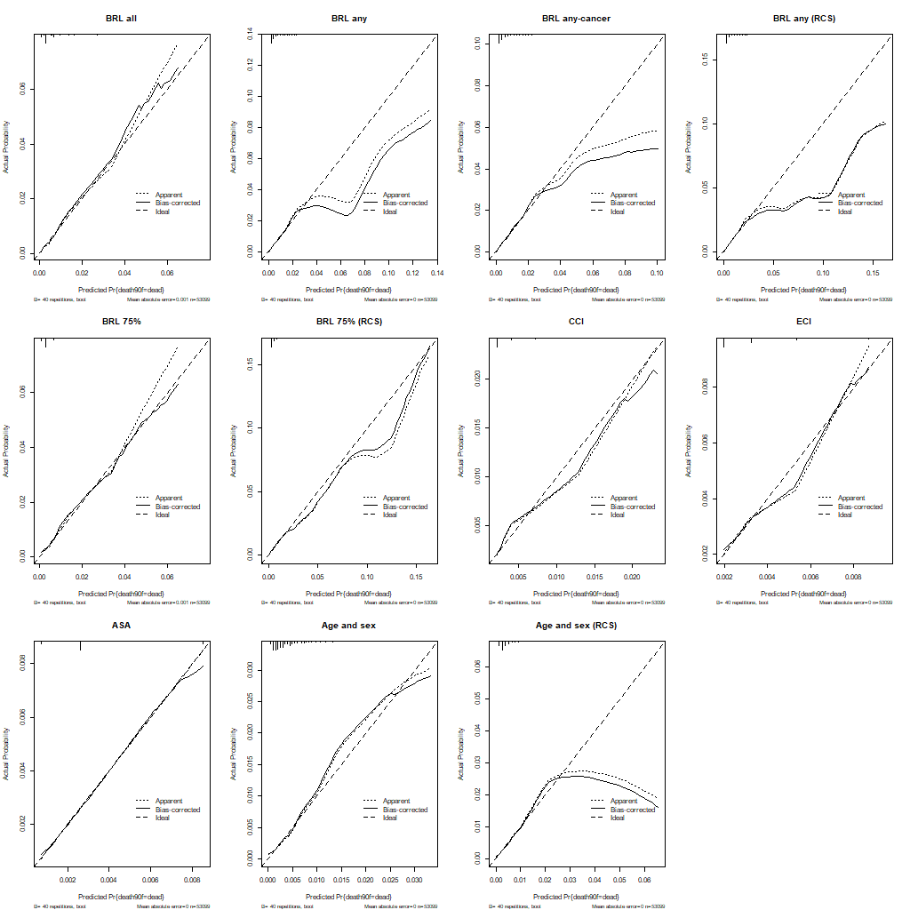

```{r setup, include=FALSE}
knitr::opts_chunk$set(echo = FALSE)
library(tidyverse)
load("../cache/all_models.RData")
```

# Optimism

Mha `rms::validate` gavs mått på optimism gm Bootstrapnig (n = 40 per default, lite lågt kanske men hniner inte köra fler just nu).

# Validering

Subtraheras optimismen från givet AUC ges AUC_est.corr enl följande:

```{r}
all_models %>% 
  select(Model, AUC_est, optimism, AUC_est.corr)
```

Görs samma modifikation på CI-gränserna (DeLong) ges:

```{r}
load("../cache/brlasso_tbl_auc.RData")
brlasso_tbl_auc
```

Här borde man kanske egentligen göra annorlunda (ta kvantiler direkt från Bootstrap-samlingen)? Diskuteras på nätet men tycks inte vara implementerat i `rms` utan kanske i så fall kräver egen programmering.

Grafiskt:

```{r}
knitr::include_graphics("../graphs/brlasso_auc_ci.png")
```

# Kalibrering

`rms::calibrate` ger följande graf. Här framgår att bias-korrektion nite ger så stor effekt i förhållande tlil den totala överskattningen.
Obsrevera att x-skalorna skiljer sig mellan olika modeller, dvs kurvorna ligger närmare för t ex "BRL all" men endast i intervallet 0-0.06.

OBS! Osäker om modellerna med splines (RCS) stämmer då `rms` kodar splines på eget sätt egentligen (vilket jag inte gjorde här).


```{r}

```

Då jag har lite svårt att avgöra vilkemn avvikelse som kan antas OK kikade jag även på "Calibrarion belts".
Se https://onlinelibrary.wiley.com/doi/full/10.1002/sim.6744

Dessa tar ej hänsyn till optimismen men enl ovan var ju den effekten ganska marginell ändå.
Här tror jag att även RCS-modellerna stämmer. 
Banden blir ju ganska breda ganska snabbt men t ex "BRL any" och "BRL any-cancer" avviker åtm inte med stat sign från den röda linjen (vilket är vad vi önskar).

```{r}
knitr::include_graphics("../graphs/calibration_belt.png")
```

