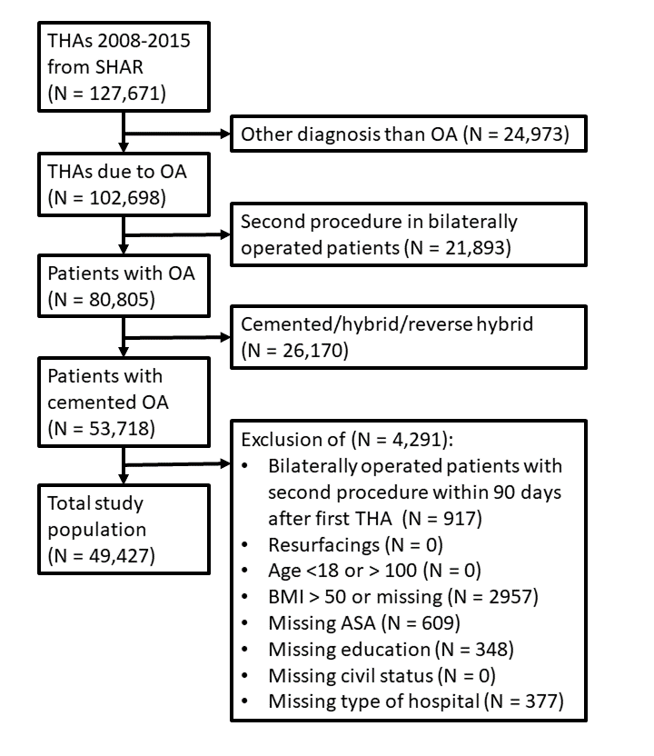

```{r setup, include = FALSE}
knitr::opts_chunk$set(echo = FALSE)
library(tidyverse)
source("../../lib/helpers.R")
```

# Affiliation and contact

1.	Department of Orthopaedics, Institute of Surgical Sciences, Uppsala University Hospital, Uppsala, Sweden  
2.	Swedish Hip Arthroplasty Register, Gothenburg, Sweden
3.	Department of Orthopaedics, Visby Hospital, Visby, Sweden 
4.	Department of Orthopaedics, Institute of Clinical Sciences, The Sahlgrenska Academy, University of Gothenburg, Gothenburg, Sweden

**Correspondence:** anne.l.garland@gmail.com, Tel: +46-498-26 80 00, Orthopeadic Department, Visby Hospital, St Göransgatan 10, 621 84 Visby, Sweden  
nils.hailer@surgsci.uu.se  
szilard.nemes@registercentrum.se  
erik.bulow@registercentrum.se  
goran.garellick@registercentrum.se  


# Introduction

The presence of comorbidities is associated with a poorer outcome after THA surgery, ie an increased risk of early postoperative mortality, an increased risk of revision [@Inacio2015; @Gordon2013] and inferior patient-reported outcomes [@Gordon2013; @Hofstede2016]. In research settings, comorbidity is commonly measured using multi-facetted diagnosis- or prescription-based coding algorithms [@Bozic2013]. @Inacio2016 performed a study where the ability of three of the most commonly used coding algorithms to predict mortality after total hip arthroplasty (THA) and total knee arthroplasty (TKA), ie, Charlson Comorbidity Index (CCI), Elixhauser Score, and RxRiskV, was evaluated. These complex comorbidity measures are based on the availability of extensive databases including in- and outpatient data on ICD-codes, or detailed information on drug prescriptions prior to surgery. Oftentimes, such databases can only be created by combining several population-based registries, raising both ethical and practical concerns. Repeated modifications of the weighting of certain items contained in the comorbidity measures, and revalidations of the scores have been necessary [@Sundararajan2004; @Deyo1992; @Quan2011; @Cleves1997; @Walraven2009]. This has resulted in numerous variations of the same score, and hence uncertainty regarding the interpretation of, and comparison between different studies. Several universal and arthroplasty-specific risk prediction tools of various degrees of complexity have been introduced in an attempt to quantify the individual patients' risk profile, but none has been broadly accepted [@Manning2016].

An easily applicable tool with few dimensions is thus needed, both in research and in clinical practice. In the context of trauma, prediction tools are common, and it has been possible to reduce the number of variables without losing predictive power [@Gerdin2016]. In this study, we therefore aimed to investigate whether the use of easily accessible data, that are routinely collected, is an alternative to complicated coding algorithms in predicting the risk of early postoperative mortality after THA. 


# Methods

## Study design and study population

```{r flowchart, fig.cap = "Flowchart."}

```


We performed a nationwide retrospective cohort study (Figure \@ref(fig:flowchart)). Primary outcome measure was ninety-day mortality, the secondary outcome measure was one-year mortality. Patients registered in the Swedish Hip Arthroplasty Register (SHAR) who received a THA due to primary osteoarthritis between 2008 and 2012 were included. Only elective primary THA procedures were included, and all other diagnoses than primary osteoarthritis were excluded, in order to minimize the risk of selection bias. 
Follow-up started on the date of surgery and ended on the day of death, emigration, or December 31st 2012, whichever came first. Only the first surgery was accounted for in bilaterally operated patients in order to avoid dependency issues. Patients were excluded if a second THA surgery was performed within 12 months after the first THA surgery, ie, neither ninety-day nor one year mortality were influenced by any subsequent THA surgery. Information on age, gender, body mass index (BMI), diagnosis codes and prescriptions registered within one year prior to surgery, and socioeconomic background was included in order to calculate and compare the comorbidity measures described below.


## Sources of data

**The SHAR** has collected information on all THA procedures performed in Sweden since 1979. The SHAR has a completeness of 96-98% and has been validated repeatedly [@Soderman2000; @shpr2014; @Soderman2001].

**Statistics Sweden** is a state-owned registry collecting demographic and socioeconomic information on the entire Swedish population, eg, marital status, level of education, and personal and family income. 

**The Swedish National Patient Register** was initiated in 1964 and contains information on diagnosis codes and dates of admissions and discharge for all individuals in Sweden. The positive predictive value of the Swedish National Patient Register is estimated around $90 \pm 5~\%$ [@Ludvigsson2011].

**The Drug Register** was initiated in 2005. The register contains information on all collected prescriptions in Sweden. 
Based on the ten-digit personal identity number that all Swedish citizens are assigned at birth or immigration, linkage of information from the databases described above is performed.


## Definitions

**The Charlson Comorbidity Index (CCI)** is a diagnose-based coding algorithm used in research [@Charlson1987]. It was developed through defining numerous clinical conditions and assessing their relevance in the prediction of one-year mortality. Each of the 19 comorbidities was then assigned a weighted score based on their relevance in prediction of one-year all-cause mortality. In the present study the original weighting of the Deyo-modification [@Deyo1992] of the index and the revised weighting according to Quan were both investigated [@Quan2011; @Charlson1987].

**The Elixhauser Score** is a diagnose-based coding algorithm used in research [@Elixhauser1998]. The Elixhauser Score is more detailed than the CCI, with 30 categories included in the original algorithm. In the present study the weighting of categories according to van Walraven was used [@Walraven2009].

**The RxRiskV Score** is a prescription-based coding algorithm used in research [@Fishman2003; @Sloan2003]. It has been argued that a prescription-based measure would be more reliable than a diagnosed based measure [@Iezzoni1997; @Johnson2006].
The American Society of Anaesthesiologists (ASA) physical status classification is a six-category physical status evaluation system that has remained unchanged except for the sixth category (brain-dead person) that was subsequently added for use in transplantation surgery [@Saklad1941]. Information on ASA grade was introduced in the SHAR in 2008, which is why our study period begins that year. ASA grade is routinely assessed pre-operatively in most developed countries. However, ASA grade has not been validated as a predictor of 90-day mortality after THA, and ASA grade is known to have a high degree of internal variability [@Haynes1995]. ASA grade has previously been compared to the CCI, but not with respect to mortality after THA [@Whitmore2014; @Kork2015]. 


## Statistics

We adhered to the guidelines on statistical analyses of register data [@Ranstam2011c; @Ranstam2011b]. Means, medians and ranges were used to describe continuous data. 95% confidence intervals (CI) described estimation uncertainty. Categorical data were investigated by cross-tabulation and the Chi-square test. The Kaplan-Meier method was used to estimate unadjusted cumulative survival. In order to calculate unadjusted and adjusted odds ratios (OR) with CI logistic regression models were fitted, with adjustment for relevant confounders (age, gender, BMI (Body Mass Index), type of hospital, fixation method, comorbidity, and socioeconomic position). Continuous variables were not categorized in order to strengthen the precision of the statistical analyses [@Altman2006]. 
The performance of the logistic regression models was evaluated by its discrimination capacity using c-statistics. The c-statistic represents the area under the curve (AUC in the plotted ROC [receiver operated characteristic] graph) and stands for the degree of predictability. We performed no imputation for missing data. 
Separate dimensions in the comorbidity algorithms (Elixhauser, CCI, and RxRiskV) that were considered relevant based on lower bounds of CI being larger than one were combined in a larger model together with age, gender, BMI, and ASA. One at a time, the different dimensions were then removed until the optimal combination with the highest c-statistic was found.


## Ethical approval

All patients registered in the SHAR have received information about the register and the type of data that are routinely collected prior to surgery, and all patients have been given the choice not to participate in the registry or associated research. In accordance with the Swedish Patient Data Law from 2009 written informed consent was not obtained from individual patients. Ethical approval for this study was obtained from the Regional Ethical Review Board in Gothenburg (2013: 360-13).


# Results

## The study population

After the exclusion process described above (Figure \@ref(fig:flowchart)) 38,735 individuals with an age between 18 and 100 years who hade undergone THA due to primary OA were eligible for analysis. Their mean age was 68.6 years (SD 10.11), and there were somewhat more women (56.2%) than men in the study population. 
The highest proportion of patients with multiple comorbidities (ie, three or more) was identified by the RxRiskV measure (69.9%). The Elixhauser Score identified 5.0% of the study population as suffering from three or more comorbidities, whereas the proportion of patients with three or more comorbidities was 3.3% when calculated according to the CCI. The proportion of patients with an ASA grade above 2 was 15.2%.
See Table 1 for characteristics of the study population.

```{r}
load("../../cache/table1.RData")
prestext(table1)
```


## Ninety-day mortality after THA

Unadjusted cumulative 90-day survival was 99.7 (CI 99.68 to 99.78) and the number of deaths during this period was 109. We found that age (OR 1.1 [CI 1.09-1.14]) and male gender were associated with an increased risk of death (OR for female gender: 0.5 [CI 0.37-0.79]). Patients with a higher degree of comorbidity according to the CCI, the Elixhauser score, and the RxRiskV score had an increased risk of 90-day mortality than patients with a lower score. After adjustment for age, gender, BMI, type of hospital, fixation method, comorbidity, and socioeconomic status only the CCI and ASA grade above 2 remained statistically significantly associated with an increased risk of 90-day mortality. Among the investigated socioeconomic background variables only the marital status of widows (-ers) was statistically significantly associated with an increased risk of 90-day mortality (adjusted OR 2.6 [CI 1.67-3.93]). Unadjusted and adjusted ORs for 90-day mortality with 95% confidence intervals are presented in Table \@ref(tab:tab2).
Exploratory analyses of the excluded 151 patients with an ASA grade above 3 showed that 149 were classified as ASA 4, 2 as ASA 5, and none as ASA 6. 27 individuals with ASA grade 4 to 6 (18%) died during the study period.

```{r tab2}
load("../../cache/t2_univariable.RData")
prestext(t2_univariable)
```


## A combination of age, gender, presence of heart infarction or renal disease, and ASA grade is the best predictor of mortality

We found that the combination of age, gender, presence of heart infarction and renal disease, and ASA grade was the best predictor of both 90-day mortality (c=0.80) and one-year mortality (Figure 2 and Supplementary Figure 1). Introduction of socioeconomic variables such as education level and marital status into the multivariable regression model only marginally increased its predictive power (data where?). Adding information on BMI to the model did not strengthen the predictive power (Supplementary Table 1). 
The Elixhauser score was better at predicting 90-day mortality than any of its separate dimensions, with a c-statistic of 0.62 for the model containing all items of the Elixhauser score (see Table 3A and Figure 2).
When examining different dimensions of the CCI we found that the model containing all items of the CCI performed better in predicting 90-day and one-year mortality than the separate dimensions did individually. The original weighting was somewhat better at predicting 90-day mortality than the weighting according to Quan (c=0.64 vs. 0.61; see Table 3B and Figure 2.)
The prescription-based RxRiskV Score was better at predicting 90-day mortality than the diagnosis-based comorbidity measures (CCI and Elixhauser Score), with a c-statistic of 0.66. The model containing all items included in the RxRiskV Score was better at predicting 90-day mortality than the separate items investigated one at a time (See Table 3C and Figure 2).
The ASA classification alone had a better predictive strength for 90-day mortality (c=0.70) than the more complex comorbidity measures CCI, Elixhauser score, and RxRiskV score (See Figure 2).


# Discussion

A set of easily accessible data is a better predictor of early mortality after major surgery than complex coding algorithms 
In this nationwide cohort study we intended to compare the performance of a set of easily accessible data that are routinely collected in daily clinical practice with complex comorbidity coding algorithms (ie CCI, Elixhauser Score and RxRiskV). The best predictive strength was found for a relatively simple model including age, gender, presence of cardiac infarction or renal disease during the last 12 months prior to THA surgery, and ASA grade (c=0.81). Thios simple model was also better than the above mentioned comorbidity measures at predicting  one-year mortality (Supplementary Figure 1 and Supplementary Table 3).
Comorbidities are known to influence the outcome after THA [@Inacio2015; @Gordon2013; @Hofstede2016]. In order to assess the effect of comorbidity on early mortality after THA different coding algorithms have been proposed in research settings. The coding algorithms are complex, and hence they demand a merge of information on ICD-ocdes and medication prescriptions from several data sources. These coding algorithms are not used in clinical settings since the administrative burden associated with identifying some 30 ICD- or ATC-codes for every patient is not realistic. Thus, comorbidity measures based on patient administrative data are only accessible to researchers, but - even then -observational study designs are hampered by the usual limitations such as incompleteness and inaccuracy of coding [@Bozic2013]. 
In this present study we found that the prescription-based RxRiskV Score performed better than the diagnosis-based comorbidity comorbidity measures CCI and Elixhauser Score in predicting 90-day mortality. The original CCI was somewhat better than the Elixhauser Score in predicting 90-day mortality. This differs from earlier findings by Inacio et al. where the RxRiskV did not perform as well as the CCI and the Elixhauser Score, and where the c- statistics were generally higher than in our study [@Inacio2016]. Such dissimilarities could be explained by the facts that our study population was younger, included more women, and that we only included diagnoses and prescriptions registered one year prior to surgery. Overall, the predictive strength of all investigated diagnose- or prescription-based comorbidity measures was better than the included dimensions investigated separately. To put it differently, in terms of predicting mortality, each comorbidity measure was an improvement over the separate items included in each measure.
We also found that the ASA classification was better at predicting both 90-day and one-year mortality than the more complex coding algorithms, with a c- statistic of 0.70. The ASA classification has been repeatedly compared to the CCI, but no consensus as to which one is superior has been reached, and, to our knowledge, such comparisons have not been performed on THA population [@Whitmore2014; @Kork2015]. Individuals with an ASA grade of 4 to 6 were excluded from our study since those categories describe severe disease, moribund and brain-dead individuals, and it can be questioned whether the classification is correct, and - if it is - whether these patients should ever have received a THA. We thus excluded this very small group.
Obesity is generally known to be associated with a higher risk of morbidity and all-cause mortality [@Must2000]. However, previous studies on primary THA cohorts have not indicated a higher risk of mortality in obese patients, a result that is confirmed in our study (Supplementary Table 1) [@Wallace2014]. An explanation could be that obese patients selected for THA are comparably healthy. 

Risk prediction may be useful in the process of patient selection prior to surgery, in the preoperative risk management including a review of current medications, and in perioperative anaesthesia management. A number of risk prediction tools of various complexity for adverse outcomes after total joint replacements have been introduced but none has been broadly accepted [@Manning2016]. In the context of trauma surgery outcome prediction tools are common, and it is seems possible to reduce the number of items without losing predictive power [@Gerdin2016]. Our results indicate that the risk of early postoperative mortality after THA could be assessed by a relatively simple prediction model.


## Strengths and limitations

A strength of this study is its nationwide design with a large cohort of primary THA patients with a reasonable number of events, rendering estimation relatively precise. Our sources of data are highly valid, and the proportion of missing data in our cohort was low [@Soderman2000; @shpr2014; @Soderman2001; @Ludvigsson2011]. Limitations to this study are the potential biases at different levels that are commonly associated with observational data, and the risk of coding errors as expected when dealing with patient administrative data. Selection bias is also an issue in this study, since patients who died on the table during attempted THA surgery may not have been reported to the SHAR, but, judging from clinical experience, such events are extremely uncommon in a population of patients scheduled for elective THA surgery for osteoarthritis. The much higher expected frequency of fatal events during THA surgery on hip fracture patients was one of the main reasons to exclude this group from the present analyses.
It is important to distinguish between explanatory observational research and attempts at predicting individual events such as early mortality after surgical interventions. The combination of parameters in the best-performing model described in the present study may serve as a predictor of mortality on an individual level, but the described combination of parameters would need to be validated in a different sample of individuals. Since this has not yet been done we cannot extrapolate our findings to prediction models in a clinical setting, but aim at performing such additional studies
Our results indicate that in research on mortality after a very common surgical intervention a less complex comorbidity measure consisting of easily accessible data that are routinely collected in daily clinical practice is superior to some of the commonly used diagnose- or prescription-based coding algorithms. It would be interesting to evaluate the ability of our novel set of parameters to predict adverse events and revision rates.


## Conclusion

Our results derived from a nationwide cohort study indicate that a less data demanding comorbidity measure, the combination of age, gender, presence of heart infarction or renal disease and ASA grade, serves is better at predicting early postoperative mortality after THA than comorbidity measures based on more complex coding algorithms. 

# Contribution of authors

AG, NH: initiated the study and managed the ethical review board application. EB, SN and AG performed the statistical analyses. GG: Assisted in preparing the review board application. AG and EB drafted the manuscript. AG, EB, SN, NH and GG took part in designing the study and editing the manuscript. 


# What this paper adds-box

## What is already known on this subject: 

A higher comorbidity burden is associated with increased early mortality after major surgery. Established comorbidity measures rely on complex coding algorithms of data on ICD- and/or prescription codes, and thus they are cumbersome instruments in research and impossible to use in clinical practice.

## What this study adds:

The combination of age, gender, presence of heart infarction or renal disease, and ASA grade was a better predictor of mortality after primary THA than the more complex comorbidity measures Charlson Comorbidity Index, Elixhauser Score and RxRiskV. Thus, a five-item instrument that is easily available in a clinical setting could both simplify research on mortality after major surgery and be developed into a simple risk prediction tool.

# Bibliography
