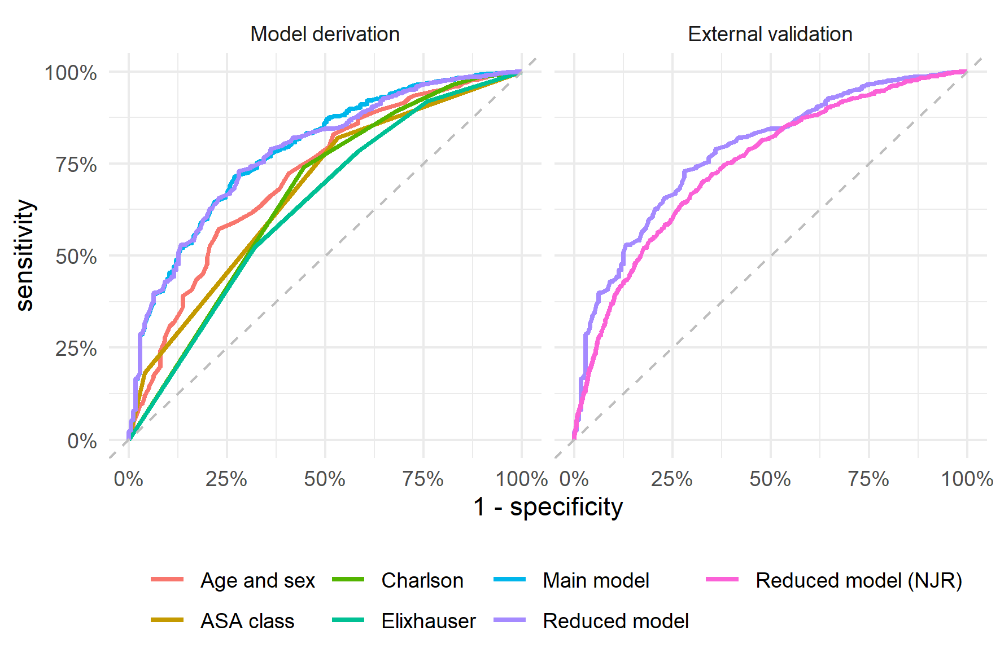
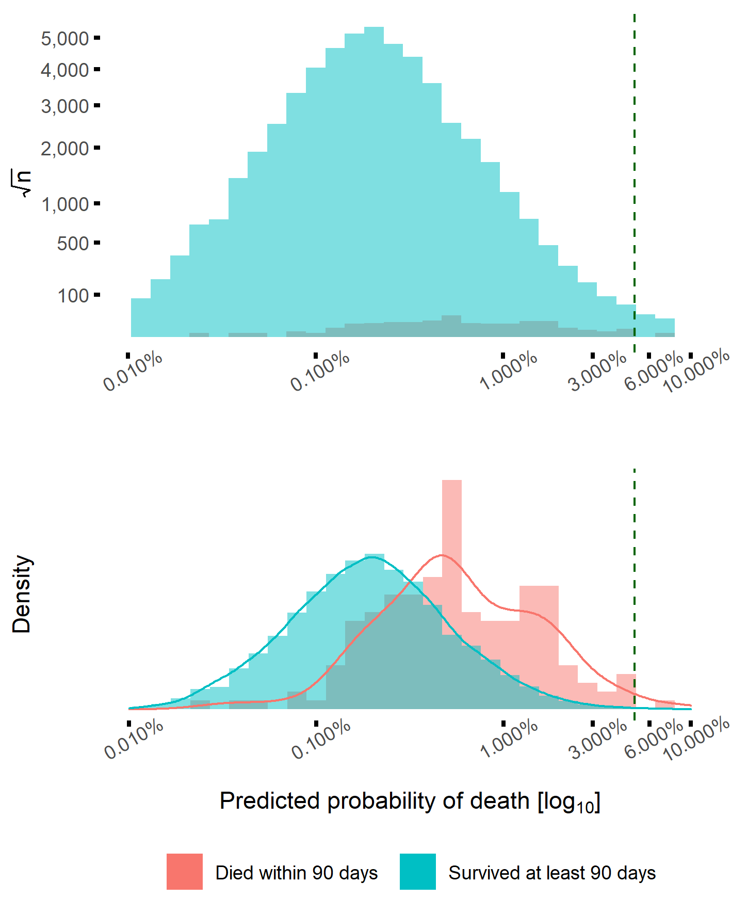

<!-- FIGURES -->

```{r flowchart, fig.cap = "Flowchart depicting inclusion criteria and number of patients. Data from the Swedish Hip Arthroplasty Register were used for model derivation and internal validation (left). Data from the National Joint Registry in England and Wales were used for external validation (right)."}
knitr::include_graphics("../graphs/flowchart.png")
```

##### PAGE BREAK

```{r rocs, fig.cap = "Receiver Operation Characteristics (ROC) curves. The area under the ROC curve (AUC) for the reduced model derived on data from the SHAR was very similar to the main model (left panel). External validation of this model, on data from the National Joint Registry for England and Wales, produced a similar curve as well (right panel)."}

```

##### PAGE BREAK

```{r aucci, fig.cap = "Area Under the Receiver Operation Characteristics Curve (AUC) as a measure of predictive discriminative ability with 95 % bootstrap confidence intervals. AUC above 0.7 were considered good. The reduced model was similar to the main model, and not statistically significantly inferior when used with external data from the NJR."}

knitr::include_graphics("../graphs/auc_ci.png")
```

##### PAGE BREAK

```{r sep, fig.cap = "The vast majority of patients survived more than 90 days after THA, and therefore the blue bars dominate the histogram (upper panel; note the scales). A normalized density plot however reveals that patients who died within 90 days were, on average, estimated to have a higher probability to do so (lower panel). There were very few observations with covariate patterns resulting in death probabilities higher than 5 % (green line). Estimated probabilities above this limit are therefore subject to extrapolation."}

```

##### PAGE BREAK

```{r calibration, fig.cap = "This figure illustrates calibration between observed proportions and predicted probabilities with 95 % confidence intervals. Deviations above the diagonal line indicated that the model under-estimated the probability of death within 90 days. Such deviation was statistically significant for the external validation for predictions below 1.5 %. In contrast, with higher predicted probabilities, the model over-estimated the observed proportions of deaths."}
knitr::include_graphics("../graphs/calibration.png")
```
