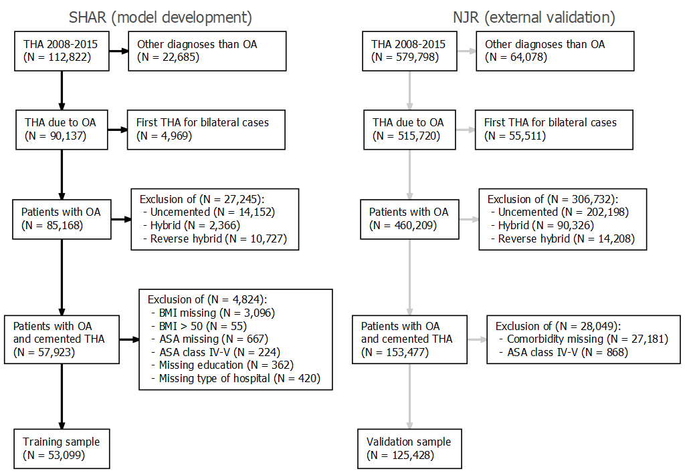
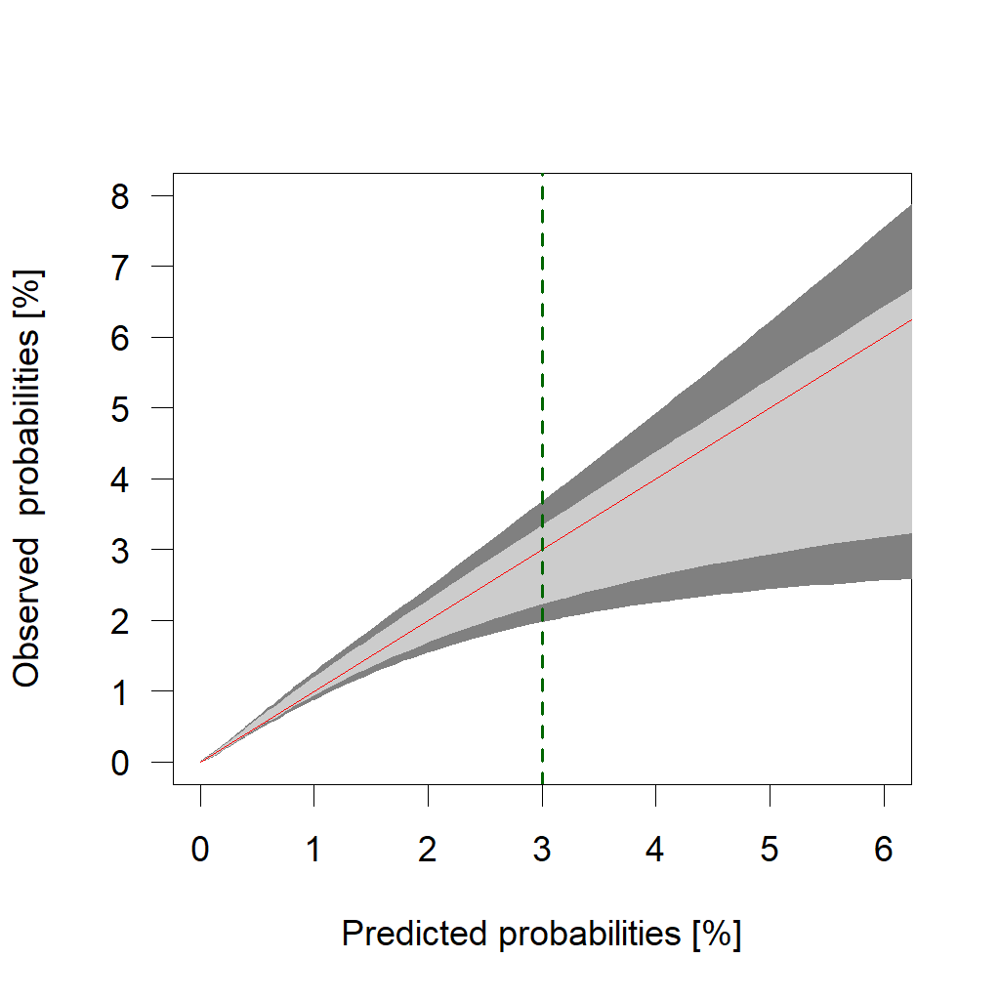

<!-- FIGURES -->

```{r flowchart, fig.cap = "Flowchart depicting inclusion criteria and number of patients included in the development and internal validation phase of the model."}

```

##### PAGE BREAK

```{r rocs, fig.cap = "ROC curves for some of the models. The 'BRL' models are superior but the reduced version works equally well as the more complex version."}
knitr::include_graphics("../graphs/brlasso_roc.png")
```

##### PAGE BREAK

```{r aucci, fig.cap = "Area Under the Curve (AUC) as a measure of predictive accuracy. Only the BRL models have AUC statistically significantly above 0.7. The reduced version works as well as the more complex model. To adjust for optimism does not effect the result."}

knitr::include_graphics("../graphs/brlasso_auc_ci.png")
```

##### PAGE BREAK

```{r sep, fig.cap = "Most patients survived more than 90 days after THA, wherefore the blue bars totally dominate the histogram (upper panel). A standardized density plot however reveals that patients who died within 90 days (pink) were, on average, estimated to have a higher probability to do so (lower panel). There were very few observations with covariate patterns resultnig in death probabilities higher than 3%."}
knitr::include_graphics("../graphs/brlasso_separation_auc.png")
```

##### PAGE BREAK

```{r calibration, fig.cap = "Calibration belts at 80% and 95% (light and dark grey). The predicted probabilities do not deviate from the observed ones by any statistical significance. The risk of over-estimation is however clear above 3%."}

```

##### PAGE BREAK


<!-- TABLES -->


```{r tabcategorization}
knitr::kable(
  tab_categorization, 
  caption = "Categorization of individual Charlson and Elixhauser comorbidities into broader comorbidities.")

```

##### PAGE BREAK

```{r tab1}
knitr::kable(
  table1, 
  caption = "Characteristics of the study population. Comorbidities recorded for at least one patient who survived 90 days, and one who did not, were modeled as potential predictors.")
```

##### PAGE BREAK

```{r brlprop}
t <- 
  brlasso_tbl_selected %>% 
  mutate(variable = clean_names(variable))

knitr::kable(
  t, 
  caption = "Variables selected by the bootstrap ranking procedure, and therefore kept in the 'BRL' model. Variables chosen at least 33 times out of 100 were kept in the 'BRL reduced' model as well. ASA grade 2 and 3 were kept in both models, since those are usually distinguished anyway. It would however be possible to use a model lumping grade 1 and 2 together.")
```

##### PAGE BREAK

```{r auc, warning = FALSE}
knitr::kable(
  brlasso_tbl_auc, 
  caption = "Area Under the Curve (AUC) as a measure of predictive accuracy for the 'BRL' model, the 'BRL reduced', a model with age and sex, as well as univariable models with ASA grade and the Charlson or Elixhauser comorbidity indices. Age was included as either a main effect, or in the form of restricted cubic splines (RCS) with three knots. 'BRL reduced' was also used without cancer and performed equally well in terms of AUC. The correction for optimism slightly decreased the AUC values, but those changes were marginal.")
```

##### PAGE BREAK

```{r brlreduced}

knitr::kable(
  select(brlasso_tbl_coefs, -math),
  caption = 'Estimated coefficients and odds ratios with 95% confidence intervals for the "BRL reduced" model.'
)
```
