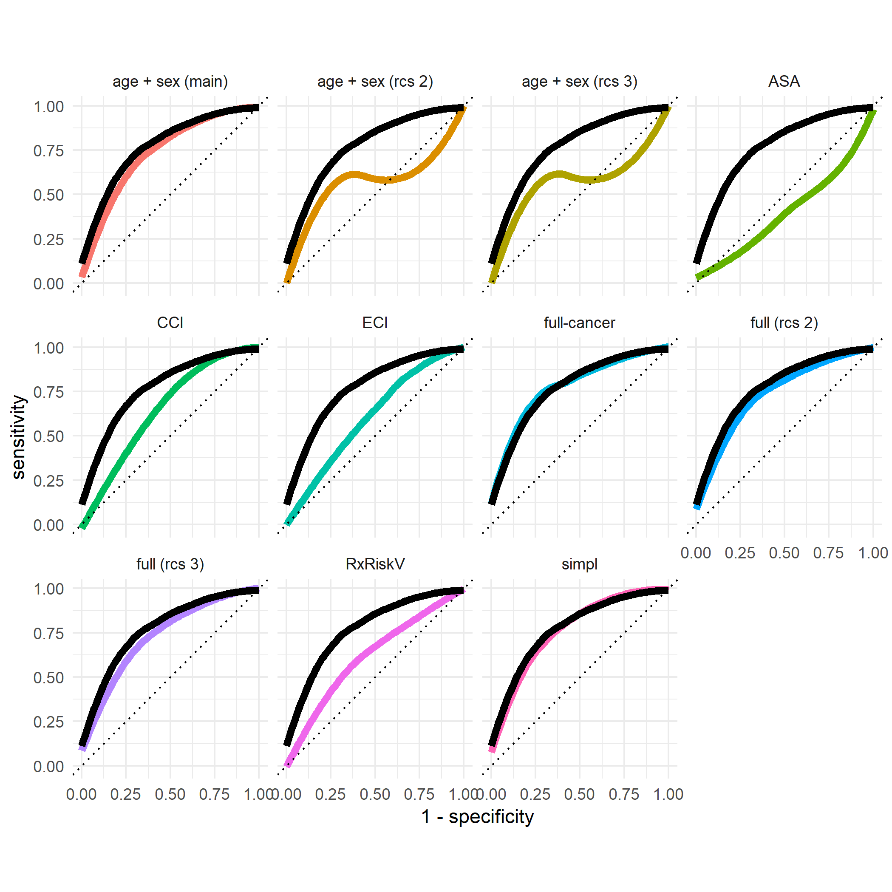
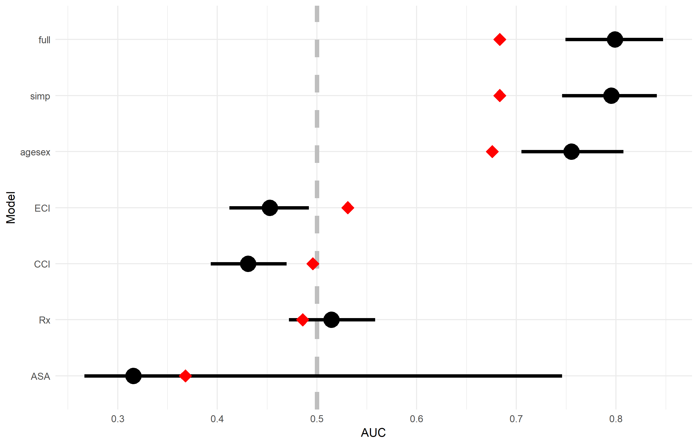
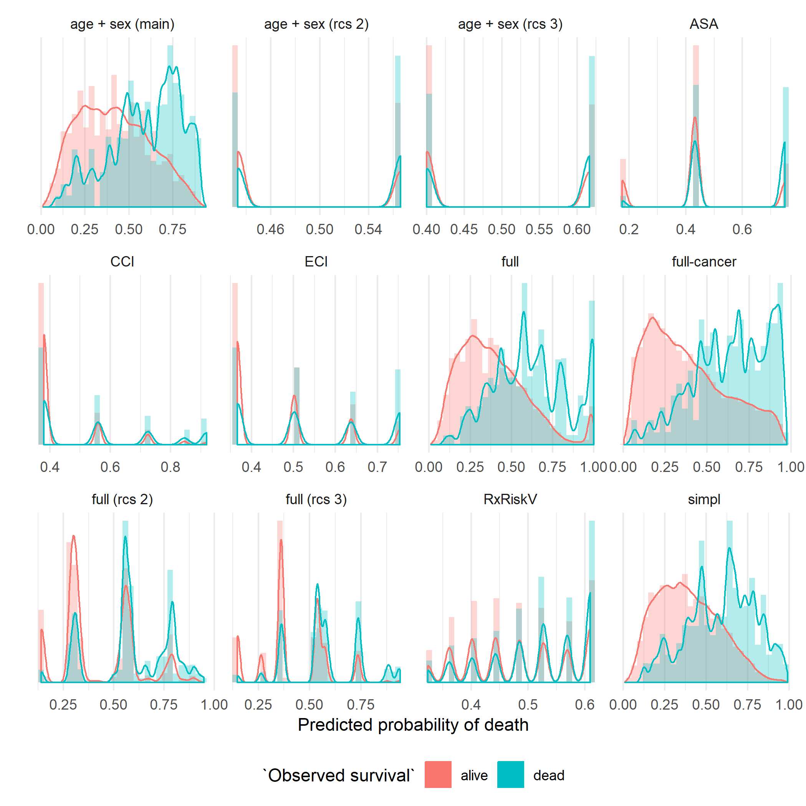

```{r setup, include=FALSE}
knitr::opts_chunk$set(echo = TRUE)
load("../cache/df.RData")
library(tidyverse)
```

# Data

I have used data from the "new linkage data base". Primary prosthesis inserted 2008-2015 were included. Note that we should have no problem with censoring here since death dates are recorded up until February 2018. Hence even if patients were operated during 2015, they are not automatically censored at the end of that year. (Censoring would only occour in the case of migration etc.)
Comorbidity indices based on Elixhauser van Walraven (ECI), Charlson's original index (CCI) and a modified Risk Rx IV index (modified by Anne Garland) were used. 

The following inclusion/exclusion criteria were applied:

1. Only primaries (no re-operations).
2. Only OA.
3. No hemi.
4. No second bilaterals.
5. No first bilateral if second bilateral inserted within a year.
6. No surface prosthesis
7. Only age 18-100 years
8. only BMI $\leq 50$
9. Only ASA $\leq 3$
10. Exclude if missing education level
11. Exclude if missing marital status level
12. Exclude if missing type of hospital
13. Exclude if fixation data missing

No imputation applied.

Exact numbers of patients/hips from each inclusion/exclusion step will be calculated after everything is set. 
The final data set has `r nrow(df)` rows with `r ncol (df)` columns:

```{r}
names(df)
```


education = 
* low = pre-gymnasium
* middle = gymnasium
* high = post-gymnasium

civil_status = married/single/widow(er). Registered partnership etc are treated as marriage.


## Data profiling report

A data profiling report is find as an appendix.
Some comments:

### Basic statistics

Most of our variables are categorical (very few numeric)

### Missing data 

We do not have any missing data (due to our selection criteria)


### Univariate distributions (numeric variables)

BMI and age are approximately normally distributed. CCI and ECI have very little data (most of the patients have no recorded comorbidities). It should be discussed whether diagnoses set during hospitalization should be included. There are some negative ECI values as well (due to the van Walraven index).


### Bar Chart (categorical variables)

Type of hospital, sex, ASA, civil status, education and prosthesis group looks as expected.

We have few patients with reversed hybrids (unbalanced sample).

We see that there are very few patients with each comorbidity (hypertension is an exception, as well as some more commonly used medications). This is problematic since logistic regression works best with outcome proportions of at least 20 %.

No one gets medically treated for dementia.

### QQ PLot

Those plots indicate (again) that age and BMI are approximately normally distributed, while some other variables are not.

We can see as well that individuals who dies within 90 days have higher ECI, CCI and age on average.


### Corelation analysis

We have too many variables to distinguish. Obviously, each variable is strongly correlated to itself (diagonal line). A cluster of correlated variables are also found in the upper right corner since outcome variables appear in different forms in the data set. We can also assume that some comorbidities are associated and obviously so for the same comorbidity measured by different indices. 

### Bivariate distribution

Older people are over-represented among the dead.


## Table 1

I include all values of each comorbidity index for the moment but those should obviously be truncated/transformed later.

Proportions for most variables are roughly the same as in earlier versions, although not exact due to the extended time frame of the study period. 
Comorbidity data differ but this is currently under discussion. 

```{r}
library(tableone)
load("../cache/t1.RData")
 t1 %>%
  print(
    showAllLevels = TRUE,
    printToggle = FALSE
  ) %>%
  as_tibble(rownames = "what")
```

## Table 2

We can also make a table similar to table 2. So far we only include univariable models.
Most of the result is consistent with the previous version of the table.

```{r}
load("../cache/t2_univariable.RData")
t2_univariable
```


# Modelling

## Risk of overfitting

We have a lot of potential predictors but very few events to predict. This is problematic and we risk overfittnig the model to the data. Hence, if we develop/train our model using all data and then use the same data to evaluate predictive power, the result will look better than it actually is (applying the model to new data will not work as well).

We can use some proportion of our data as a hold-out sample to use for later validation. It is common to use 75 % of the data for model training and 25 % for evaluation. We can choose however to use 90 % for training and 10 % for evaluation. With the rare event rate, a totally random 90/10-split might lead to extremely few "positive outcomes" (deaths) in the evaluation set. The sampling is therefore stratified on the outcome. 


## Downsamling

The training set will now have approximately `r round(nrow(df) * .9)` patients. Only about 0.26 % of those will die within 90 days. A secure bet then will be to assume that everyone will survive. Such a model will have perfect specificity. The sensitivity will of course be 0, but most likely it will anyway if the difference between patients who dies and survive is not clear-cut. Hence, if we are to use any sort of step-wise regression modelling, the estimated coefficients for a model based on all this data, will underestimate the true coefficient values (the model will be too conservative) [@King2001].

A common and simple solution to this problem is to use down-sampling. This is done by matching if the goal is to compare treatments or similar. We can not use matching in our case (we are not comparing groups based on variables that we have not yet selected). We can however simply include all cases and then as many controls (survivors). 

An alternative to down-sampling is up-sampling or a combination of the two [@Lunardon2014].
An additional benefit of down-sampling however is that we will also reduce the sample size (without losing too much power). This is beneficial since step-wise regression techniques around 100 variables and a large data set will otherwise be very time consuming.

With a balanced data set, we can no longer cheat by predicting everyone as survivors without a severe loss of specificity. We therefore force the model to do a much better job (not underestimating the beta coefficients in the logistic regression model).


# Uncertainty 

A draw-back with the down-sampling however is that we might get a sample that is not representative for the larger population. Our estimates might be very sensitive to the individuals who just happened to show up in the sample. If we perform a step-wise regression on two different samples, it would therefore be possible that each data set will provide two different set of models (based on different predictors) [@Lukacs2010; @Sauerbrei1999; @Zellner2004]. 

A theoretically simple (although computationally intense) method is to repeat this procedure several times with different samples. We will do that.


## Candidate predictors
 
I took 1,000 bootstrap replicates of the training data and applied down-sampling to each of those. 
For each sample I used the Aikake Information Criteria as a selection criteria within step-wise regression. I saved a list of the selected variables for each "winning model". Note that the size of the coefficients for those variables are not yet important. The same variable can even have a positive effect in one model, but a negative effect in another (depending on which other variables are included, thus which part of the population would constitute the base line).

Note that variables that are highly correlated could not be included in the same selection step, since it will then be arbitrary which one of those to select. I therefore used four independent step-wise regression procedures to each re-sample evaluating:

1. General variables including comorbidity indices
2. Individual ECI diagnosis
3. Individual CCI diagnosis
4. Individual Risk Rx IV diagnosis

Of course in the first group, it could be argued that the different comorbidity indices are correlated with each other. We did not see this in practice however.

The following table list all assessed variables ordered by the proportion of times for which they were included in the final model chosen by the step-wise procedure. 


```{r}
load("../cache/prop_selected.RData")
DT::datatable(prop_selected)
```

It is common to use univariable screening before the step-wise procedure, which was here considered redundant since univariable models are already included in the step-wise procedure (see [@Harrell2015]).

I also tried the Bayesian Information Criteria (BIC) instead of AIC, but it promotes simpler models quite heavily in this case, wherefore fewer predictors will end up in the final model. I did not find this to be desirable yet.

We can see from the table above that most potential predictors end up in less than half of all models. We can illustrate the distribution of proportions for a more intuitive overview:

```{r}
ggplot(prop_selected, aes(value)) + 
  geom_density(fill = "lightblue") + 
  theme_minimal()
```

It is usually recommended to only include variables that are in fact chosen in around 90 %
 (or even 95 % of the cases). This would be age, ASA, medication for inflammatory pain and sex in our case. We could use a 75 % limit however since this is not our final model.
 
Note that heart infarction and renal disease did not show up here. Those were included last time but we can see from the table above that those were in fact choose in less than 75 % of our Bootstrap-samples. It might be argued that those were in fact important predictors in the original sample. The goal of prediction modelling however is not to evaluate the past but to predict the future! 

We now have the following candidate predictors:

```{r}
load("../cache/candidates.RData")
candidates
```

It was actually only ASA = 3 that showed up above (level 2 could not be distinguished from level 1) but we include both levels any way (the data is already available so why not use it?).


# Combined model 

The candidate variables above where found from four different starting points. We can now argue that those variables should not be heavily associated with each other. It would have been different if for example heart infarction would have been important if classified both by ECI, CCI and Rx. We could then combine those factors into one (which was done for the previous version of the manuscript). This might also be necessary with a different threshold than 75 %. It might nevertheless be relevant to use step-wise regression once more based on the smaller subset of candidate variables.

It would be possible to do this on the whole training data set. We would still have the same uncertainty problem as above however. Instead we can use "bagging" (bootstrap aggregating), hence repeated bootstrap samples (again), with down-sampling performed to each re-sample and a full main effects model estimated for each re-sample. This is similar to above but the result from each sample is not only a set of candidate predictors but also estimates of each coefficient associated with those variables. Also, models of all possible combinations of potential predictors are tried out, not only the few where AIC were not increased. We get the following results:

```{r}
load("../cache/modsums.RData")
round(modsums$modsum[[1]]$coefmat.full, 2)
```

Hence, only CCI, age and ASA = 3 seems to be important.


# Additional models

Given the results above, we might be tempted do drop the Rx-variables. It would be nice if those were not needed since acquiring this data in clinical practice might be cumbersome. Sex on the other hand is almost always available anyway. Hence, we'll better keep it. This will yield an alternative model for comparison:

```{r}
round(modsums$modsum[[2]]$coefmat.full, 2)
```

Figure 2 in the earlier version of the manuscript also included models with only ASA, CCI, ECI and Risk Rx. We will do too for comparison and can add a model  with age and sex only as well.


# Predictive power

We now 7 models that can be compared based on predictive power, thus by area under the (ROC) curve (AUC).
Let's take another 1,000 bootstrap replicates and compare observations to predictions for those. Note that we do not only use the list of predictors for each model, but also the estimated coefficients. We thus evaluate the models from above, rather than fitting new ones and evaluate again. We do this to decrease overfitting. This will give us 1,000 ROC curves for each model. We could plot all of those but the resulting figure would be quite messy (and time consuming to draw). I therefore fitted a locally estimated scatter-plot smoothing (LOESS) line as an average ROC-curve based on individual bootstrap estimates.  

Overfitting will nevertheless occur since we are in fact still using the training data. We thus need to re-calculate AUC-values one final time for the evaluation data set, the 10 % of the original data that we have not looked at yet. We could apply Bootstrap replicates to the test data as well in order to estimate uncertainty/confidence intervals. Those would probably we very wide though and are avoided to save (computational) time.


# Results and interpretation

Averaged ROC-curves for each model is illustrated below. Curves below the dotted line would not occur if the models had been estimated and evaluated using the same data set. This is not the case here and we do in fact have models that perform worse then random. This happens for models with only a few possible values of its predictors, since those models are insensitive to nuances not captured by those limited values. This is also a clear sign of over-fitting (the model is too heavily biased to the initial data and the result can not be generalized to a larger population).

The funny looking shape of the ASA model is due to the fact that we have only three distinct value for this predictor. The model must therefore assign all patients with the same score as either dead or alive after 90 days. This is a blunt tool!

There seems to be no relevant difference between the full and simplified model. This is good, since we can then avoid the cumbersome data retrieval of prescription data if using the model in practice. A simpler model with age and sex only, is almost as good, especially applied to a previously unseen data set (which is what we should care about).

It is evident that ROC curves from the training data over-estimate the predictive power of each model. This is clear since ROC curves for the evaluation set deviates less from the horizontal line. 


```{r}

```


We could  summaries the ROC curves by their area under the curve (AUC). We have used bootstrap replicates and can therefore select the 2.5 % smallest and largest estimates as confidence limits based on the training data. We can present the same data either in a table, or graphically.

```{r}
load("../cache/auc_table.RData")
auc_table
```


```{r}

```


We can conclude that the winning model have the same AUC as the chosen model from the previous version of the manuscript (0.8). We could also conclude however that this is an optimistic estimate since we do not reach that far using the test data. We can also conclude that the full model is in fact no better than the slightly simplified model or the model with age and sex only.

It might seem strange that both CCI and ECI actually underestimate the AUC. We can see above however that corresponding curves based in the evaluation data are very close to the diagonal with just a few exceptions. We might suspect that the larger training set included some extreme values for those indices that became influential for the model building, but which were not present in the evaluation set. We said in the beginning that a common split between training data and evaluation data is 3:1. We had 9:1 (which we knew were risky). We did so because the outcome is so rare and we therefore wanted to maximize the available data for estimation.

Lets have a look at the extremes of the Elixhauser index (CCI is less extreme but have a similar tendency). Most patientd have ECI within the range -4 to 17. Those are excluded here: 

```{r}
load("../cache/ECI_extremes.RData")
ECI_extremes %>% 
  filter(!ECI_index_walraven %in% -4:17)
```

Hence, there is only one individual with ECI = -14, and she was assigned to the training set. She had obesity, drug abuse and depression, all associated with a long and happy life according to Van Walraven (Sic!). 

The patient with ECI = 33 on the other hand had congestive heart failure, cardiac arrhythmia, hypertension, renal failure and a solid cancer tumor with metastases.

Both of those patients actually survived 90 days after their surgery (which is an indication to why ECI does not work as a predictor of death)!

One way to avaoid exrteme observations for ECI/CCI would be to transform those variables by the Yeo-Johnson transformation. I tried this but it did not help. It might therefore be reasonable tom simply truncate the scale (or even ignore/exclude those extreme cases).


## Separation 

Another attempt to illustrate each models ability to classify patients as either dead or alive is depicted below. If a model was able to fully predict death, the blue and red areas would be completely separated. If the model can not predict anything at all, those colors would completely blend into each other. More blue to the right means that people who actually died where also predicted to do so. We can see once more that the separation is larger when the models are applied to the training data, compared to the evaluation data set.

```{r}

```

